# Git Intro Project

# 🏠 HBnB Evolution - Part 1


## 📋 Description

Projet HBnB Evolution développé dans le cadre du programme Holberton School. Cette partie (Part 1) se concentre sur la conception et la documentation de l'architecture du système.

## 🔄 Diagrammes

Le projet comprend plusieurs diagrammes illustrant l'architecture et les flux de l'application :

### 📊 Documentation des Diagrammes

- **[📈 Business Logic Diagrams](./business_diagrams.md)** - Diagrammes de la logique métier et des services
- **[🔌 API Sequence Diagrams](./diagrams_api.md)** - Diagrammes de séquence des interactions API
- **[📦 Package Diagrams](./diagrams_package.md)** - Diagrammes de la structure des packages

### Diagrammes de Séquence Principaux

Les 4 flux principaux de l'application :


## 📁 Structure du Projet
```
holbertonschool-hbnb/
└── part1/
    ├── business_diagrams.md    - Diagrammes de logique métier
    ├── diagrams_api.md         - Diagrammes de séquence API
    ├── diagrams_package.md     - Diagrammes de packages
    └── README.md               - Ce fichier
```

## 👥 Auteurs

- **Holberton School** - Projet Académique
- [@Annonym12345](https://github.com/Annonym12345)
- [Mahamadou19-75](https://github.com/Mahamadou19-75)
---

**Note**: Ce projet est réalisé dans un cadre éducatif à Holberton School.
